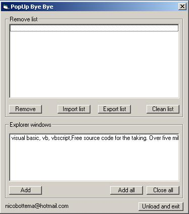



## PopUp Bye Bye v1\.0 Popup remover

### Description

This removes your explorer of these annoying popup windows. You can Add popups, and export/import popup lists to exchange with other users etc. It has tray functionality so it runs on the background. PLEASE VOTE ON THIS !
 
### More Info
 

             |
---                |---
**Submitted On**   |2003-07-12 11:15:08
**By**             |[Nico Bottema](https://github.com/Planet-Source-Code/PSCIndex/blob/master/ByAuthor/nico-bottema.md)
**Level**          |Intermediate
**User Rating**    |5.0 (10 globes from 2 users)
**Compatibility**  |VB 4\.0 \(16\-bit\), VB 5\.0, VB 6\.0
**Category**       |[Complete Applications](https://github.com/Planet-Source-Code/PSCIndex/blob/master/ByCategory/complete-applications__1-27.md)
**World**          |[Visual Basic](https://github.com/Planet-Source-Code/PSCIndex/blob/master/ByWorld/visual-basic.md)
**Archive File**   |[PopUp\_Bye\_1613287122003\.zip](https://github.com/Planet-Source-Code/nico-bottema-popup-bye-bye-v1-0-popup-remover__1-46839/archive/master.zip)

